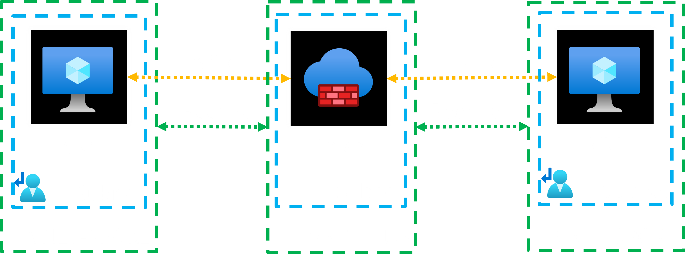

# Connecting to Azure VMs using Bastion with RDP and SSH

## Introduction

You will learn how to connect to Azure VMs using Bastion and native client. You will connect to Linux VM using SSH and connect to Windows VM using RDP.

## Deploy the demo lab

The demo lab is shown on the following architecture diagram.


It is scripted in Terraform. 
To deploy it, simply run the terraform commands.

```sh
terraform init
terraform apply -auto-approve
```

The deployment will take about 13 minutes.
After that, you will be ready to connect to the VMs.
To do that you will need the resource IDs for the two VM.

```sh
az vm list --query [].id
# [
#   "/subscriptions/38977b70-47bf-4da5-a492-88712fce8725/resourceGroups/RG-VM-LINUX/providers/Microsoft.Compute/virtualMachines/vm-linux",
#   "/subscriptions/38977b70-47bf-4da5-a492-88712fce8725/resourceGroups/RG-VM-WINDOWS/providers/Microsoft.Compute/virtualMachines/vm-windows"
# ]
```

Then you can run the command to initiate the connection from the command line.
Make sure to replace the value with your own VM ID.

Connect to the Linux VM using SSH.
```sh
az network bastion ssh -n bastion-host -g rg-bastion --target-resource-id /subscriptions/xxx/resourceGroups/rg-vm-linux/providers/Microsoft.Compute/virtualMachines/vm-linux
```

Connect to the Windows VM using RDP.
```sh
az network bastion rdp -n bastion-host -g rg-bastion --target-resource-id /subscriptions/xxx/resourceGroups/rg-vm-windows/providers/Microsoft.Compute/virtualMachines/vm-windows
```

## Clean up resources

```sh
terraform destroy -auto-approve
```