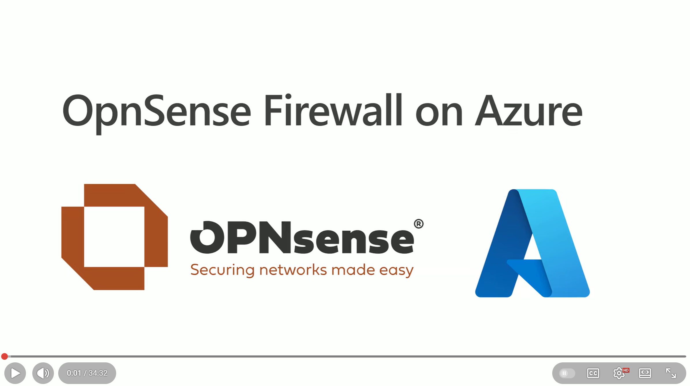
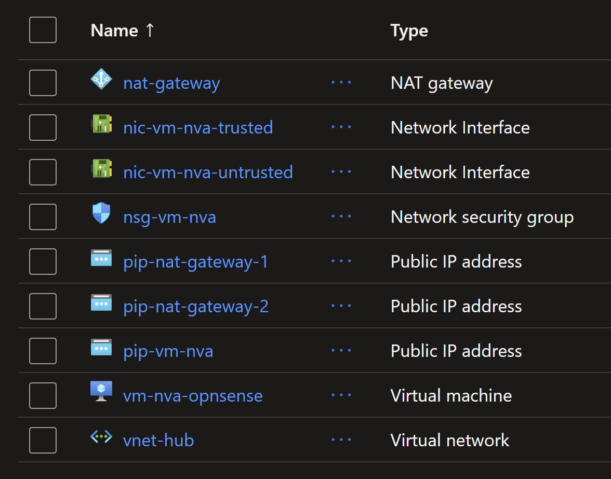
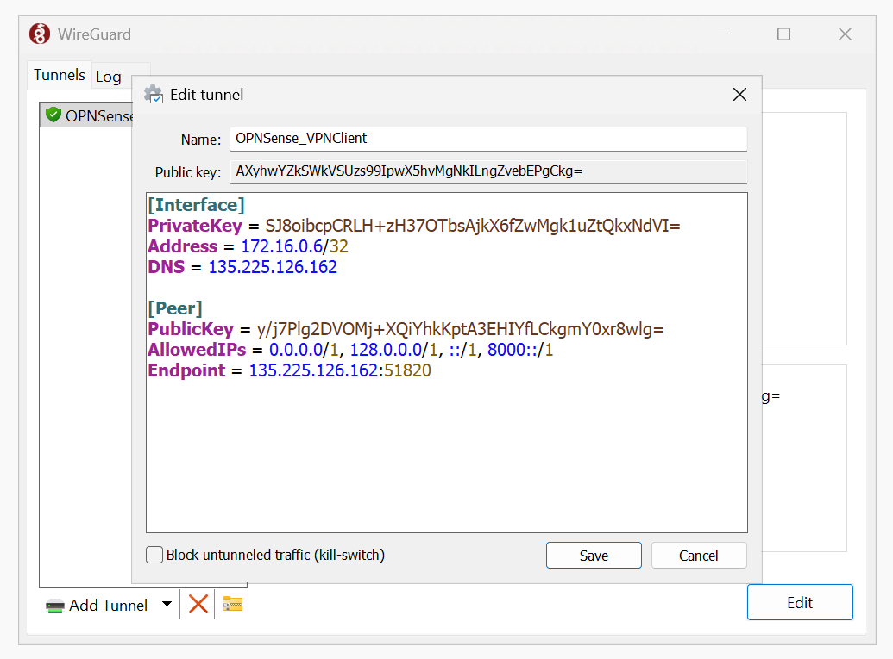
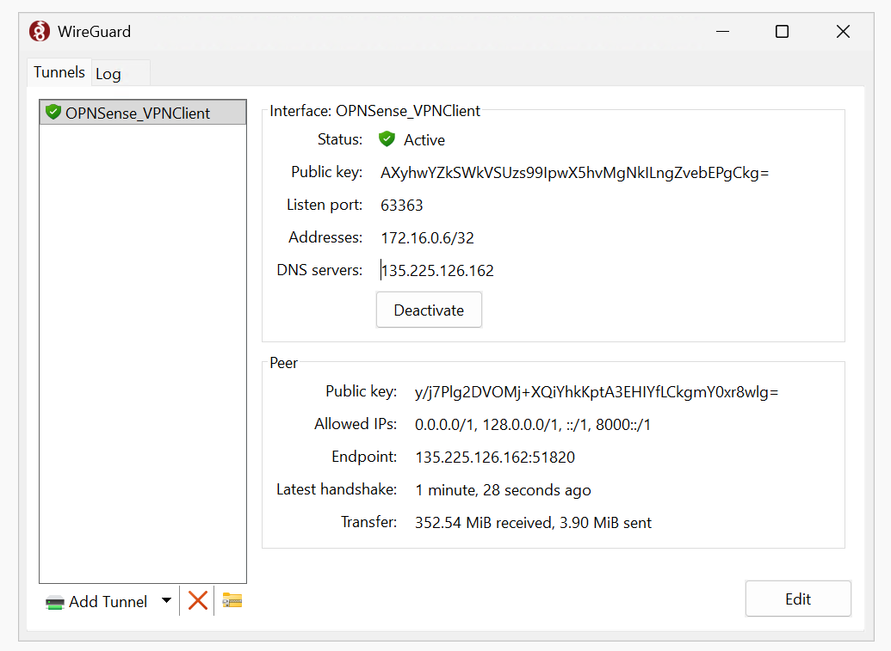

# OPNSense Firewall as Network Virtual Appliance (NVA) in Azure

This repository contains configuration files and instructions to set up an OPNsense firewall as a Network Virtual Appliance (NVA) in Azure. 


This blog is available as a video on YouTube: [youtube.com/watch?v=JtnIFiB7jkE](https://www.youtube.com/watch?v=JtnIFiB7jkE)



## Introduction to OPNsense

In today’s cloud-driven world, securing your infrastructure is more critical than ever. One powerful solution is OPNsense. OPNsense is a powerful [open-source](https://github.com/opnsense/core) firewall that can be used to secure your virtual networks. Originally forked from pfSense, which itself evolved from [m0n0wall](https://m0n0.ch/), OPNsense is based on `FreeBSD` and provides a user-friendly web interface for configuration and management.
What makes OPNsense Firewall stand out is its rich feature set:

* **VPN Support** for point-to-site and site-to-site connections using technologies like WireGuard and OpenVPN.
* **DNS Management** with options such as OpenDNS and Unbound DNS.
* **Multi-network handling**, enabling you to manage different LANs seamlessly.
* **Advanced security features**, including intrusion detection and forward proxy integration.
* **Plugin ecosystem**, supporting official and community extensions for third-party integrations.

In this guide, you’ll learn how to install and configure OPNsense Firewall on an Azure Virtual Machine, leveraging its capabilities to secure your cloud resources effectively. We'll have three demonstrations:

1. Installing OPNsense on an Azure virtual machine
2. Setting up point-to-site VPN using WireGuard
3. Using OPNsense as an NVA in a Hub and Spoke topology

## 1. Installing OPNsense on an Azure Virtual Machine

There are three ways to have OPNsense in a virtual machine.

* Create a VM from scratch and install OPNsense.
* Install using the [pre-packaged ISO image](https://opnsense.org/get-started/) created by `Deciso` the company that maintains OPNsense.
* Use a pre-built VM image from the [Azure Marketplace](https://azuremarketplace.microsoft.com/en-en/marketplace/apps/decisosalesbv.opnsense?tab=Overview).

In this demo, we will use the first approach to have more control over the installation and configuration. We will create an Azure VM with `FreeBSD OS` and then install OPNsense using a shell script through the `Custom Script Extension`.

All the required files are in this repository: https://github.com/HoussemDellai/azure-network-course/tree/main/205_nva_opnsense.

The shell script `configureopnsense.sh` will install OPNsense and apply a predefined configuration file `config.xml` to set up the firewall rules, VPN, and DNS settings. It will take 4 parameters:

*   GitHub path where the script and config file are hosted, in our case it is `https://raw.githubusercontent.com/HoussemDellai/azure-network-course/refs/heads/main/205_nva_opnsense/scripts/`.
*   OPNsense version to install, currently set to `25.7`.
*   Gateway IP address for the trusted subnet.
*   Public IP address of the untrusted subnet.

This shell script is executed after the VM creation usingthe `Custom Script Extension` in Terraform represented in the file `vm_extension_install_opnsense.tf`.

OPNsense is intended to be used an `NVA` so it would be good to apply some of the good practices. One of these practices is to have two network interfaces:

*   **Trusted Interface**: Connected to the internal network (spokes).
*   **Untrusted Interface**: Connected to the internet (WAN).

This setup allows OPNsense to effectively manage and secure traffic between the internal network and the internet.

Second good practice is to start with a predefined configuration file (`config.xml`) that includes the basic settings for the firewall, VPN, and DNS. This approach saves time and ensures consistency across deployments. It is recommended to start with closed firewall rules and then open them as needed based on your security requirements. But for demo purposes, we will allow all traffic.

Third good practice is to use multiple instances of OPNsense in a high-availability setup to ensure redundancy and failover capabilities. However, for simplicity, we will use a single instance in this demo.

Let's take a look at the resources that will be created by Terraform using the **AzureRM provider**:

*   **Resource Group**
*   **Virtual Network (VNET)** named `vnet-hub` with two subnets:
    *   **Trusted Subnet**: Internal traffic between spokes.
    *   **Untrusted Subnet**: Exposes the firewall to the internet.
*   **Network Security Group (NSG)**: attached to the untrusted subnet, with rules allowing traffic to the VPN, OPNsense website and to the internet.
*   **Virtual Machine**:
    *   **FreeBSD OS** image using version `14.1`.
    *   VM size: `Standard_D4ads_v6` with NVMe disk for better performance.
    *   Admin credentials: feel free to change the username and password with more security.
*   **Two NICs** (trusted and untrusted) with **IP forwarding enabled** to allow traffic to pass through the firewall.
*   **NAT Gateway**: attached to the untrusted subnet for outbound internet connectivity.

### **Apply Terraform configuration**

To deploy the resources, run the following commands in your terminal from within the `205_nva_opnsense` directory:

```bash
terraform init
terraform apply -auto-approve
```

Terraform provisions the infrastructure and outputs resource details.
In the Azure portal you should see the newly created resources.



### **Access the OPNsense dashboard**

1.  Get the VM’s public IP from the Azure portal or from Terraform output.
2.  Paste it into your browser. Accept the TLS warning (TLS is not configured yet).
3.  Log in:
    *   **Username**: `root`
    *   **Password**: `opnsense` you can change it later in the dashboard.

You now have access to the OPNsense dashboard where you can:

*   Monitor traffic and reports.
*   Configure firewall rules for LAN, WAN, and VPN.
*   Set up VPNs (WireGuard, OpenVPN, IPsec).
*   Configure DNS services (OpenDNS, UnboundDNS).


Now that the OPNsense firewall is up and running, let's move to the next steps to explore some of its features like VPN and integration with Hub and Spoke networks.

## 2. Setting up Point-to-Site VPN using WireGuard

We’ll demonstrate how to establish a **WireGuard VPN connection** to OPNsense firewall. The configuration file `config.xml` used during installation already includes the necessary settings for WireGuard VPN. For more details on how to set up WireGuard on OPNsense, refer to the [official documentation](https://docs.opnsense.org/manual/how-tos/wireguard.html).

We will generate a `Wireguard` peer configuration using the OPNsense dashboard. Navigate to `VPN > WireGuard > Peer generator` then add a name for the peer, fill in the IP address for the OPNsense which is the public IP of the VM in Azure, use the same IP if you want to use the pre-configured UnboundDNS. Then copy the generated configuration and click on `Store and generate next` and `Apply`.


Next we'll use that configuration to set up WireGuard on a Windows client. Here you can either use your current machine as a client or create a new Windows VM in Azure. We'll go with this second option for better isolation. We'll deploy the client VM using Terraform file `vpn_client_vm_win11.tf`. Make sur it is deployed using command `terraform apply -auto-approve`.

Once the VM is ready, connect to it using RDP, download and install WireGuard from [here](https://www.wireguard.com/install/). Alternatively, you can install WireGuard using the following `Winget` command:

```sh
winget install -e --id WireGuard.WireGuard --accept-package-agreements --accept-source-agreements
```

Launch WireGuard application, click on `Add Tunnel > Add empty tunnel...`, then paste the peer configuration generated from OPNsense and save it.



Then click on `Activate` to start the VPN connection. We should see the data transfer starting.



We'll verify the VPN connection by pinging the VM, checking the outbound traffic passes through the Nat Gateway's IPs and also checking the DNS resolution using UnboundDNS configured in OPNsense.

```sh
ping 10.0.1.4 # this is the trusted IP of OPNsense in Azure
# Pinging 10.0.1.4 with 32 bytes of data:
# Reply from 10.0.1.4: bytes=32 time=48ms TTL=64
# ...

curl ifconfig.me/ip # should display the public IP of the Nat Gateway in Azure
# 74.241.132.239

nslookup microsoft.com # should resolve using UnboundDNS configured in OPNsense
# Server:  UnKnown
# Address:  135.225.126.162
# Non-authoritative answer:
# Name:    microsoft.com
# Addresses:  2603:1030:b:3::152
#           13.107.246.53
#           13.107.213.53
# ...
```

## What's next ?

Now that you have OPNsense firewall set up as an NVA in Azure and have successfully established a WireGuard VPN connection, we can explore additional features and configurations such as integrating OPNsense into a Hub and Spoke network topology. That will be covered in the next part of this blog.

## Disclaimer
The sample scripts are not supported under any Microsoft standard support program or service. The sample scripts are provided AS IS without warranty of any kind. Microsoft further disclaims all implied warranties including, without limitation, any implied warranties of merchantability or of fitness for a particular purpose. The entire risk arising out of the use or performance of the sample scripts and documentation remains with you. In no event shall Microsoft, its authors, or anyone else involved in the creation, production, or delivery of the scripts be liable for any damages whatsoever (including, without limitation, damages for loss of business profits, business interruption, loss of business information, or other pecuniary loss) arising out of the use of or inability to use the sample scripts or documentation, even if Microsoft has been advised of the possibility of such damages.