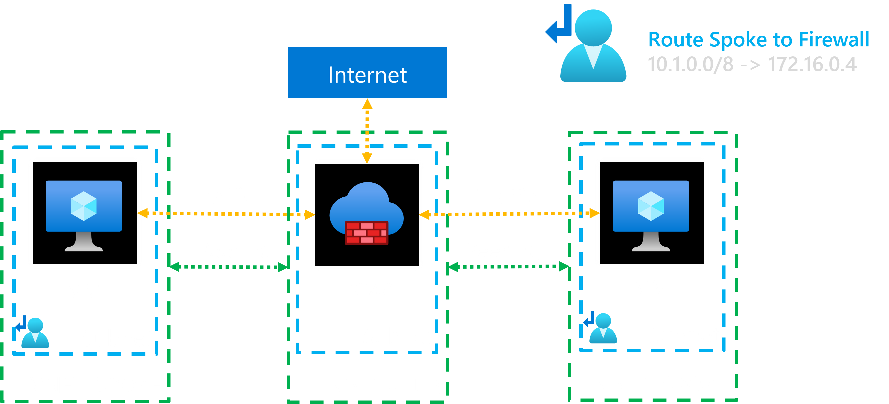

# Introduction to Azure Firewall



## Learnings

When deploying a Private Endpoint, its IP address will be automatically added to the subnet's effective routes of the subnet where the Private Endpoint is deployed and to the peered subnets/VNETs. This means that any traffic destined for the Private Endpoint's IP will be routed directly to it, bypassing any Network Virtual Appliances (NVAs) or firewalls in place.

The IP will be advertized only to direct peered VNETs, not transitive peered VNETs.

There are two main ways to ensure that traffic to a Private Endpoint is inspected by an NVA or firewall:

1. **Override the effective route of the Private Endpoint**: Add a more specific route in the route table associated with the source subnet This route should direct traffic destined for the Private Endpoint's IP address to the NVA or firewall. This means: `PRIVATE_IP_PE/32 -> NVA_IP`.

2. **Enable Network Policy at the Subnet**: By enabling network policy on the subnet where the Private Endpoint is deployed, you can ensure that all traffic to and from the Private Endpoint is subject to the network security rules defined in your NVA or firewall. This effectively forces traffic through the NVA/firewall for inspection.


## Deploy terraform template

```sh
terraform init
terraform apply -auto-apply
```

curl 10.2.1.4 --header 'Host: inspector-gadget.ashymoss-4ece81e9.swedencentral.azurecontainerapps.io'

curl 10.2.1.4/api/introspector --header 'Host: inspector-gadget.ashymoss-4ece81e9.swedencentral.azurecontainerapps.io' | jq .request[7]

sudo docker run -d -p 80:80 jelledruyts/inspectorgadget

curl 10.2.2.5/api/introspector | jq .request[7]

sudo apt update
sudo apt install traceroute

```sh
# azureuser@vm-linux-hub:~$
traceroute inspector-gadget.ashymoss-4ece81e9.swedencentral.azurecontainerapps.io
# traceroute to inspector-gadget.ashymoss-4ece81e9.swedencentral.azurecontainerapps.io (10.2.1.4), 30 hops max, 60 byte packets
#  1  * gsa-01be8da6-9d06000001.internal.cloudapp.net (172.16.0.6)  0.884 ms *
#  2  * * *
#  3  * * *
#  ...
 ```

```sh
# azureuser@vm-linux-hub:~$ 
curl 10.2.1.4 --header 'Host: nginx.ashymoss-4ece81e9.swedencentral.azurecontainerapps.io'
# <!DOCTYPE html>
# <html>
# <head>
# <title>Welcome to nginx!</title>
# <style>
```

## More resources

Exploring Private Endpoint routing in Azure: https://denishartl.com/2025/10/17/exploring-private-endpoint-routing-in-azure/