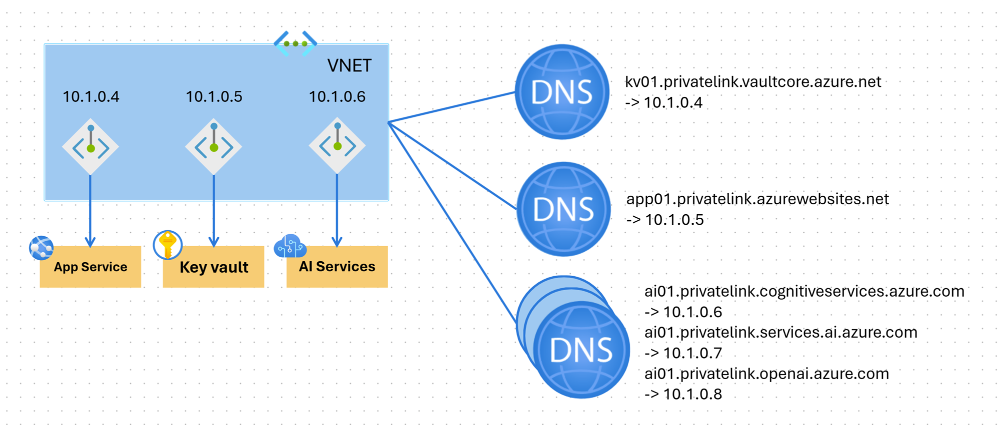
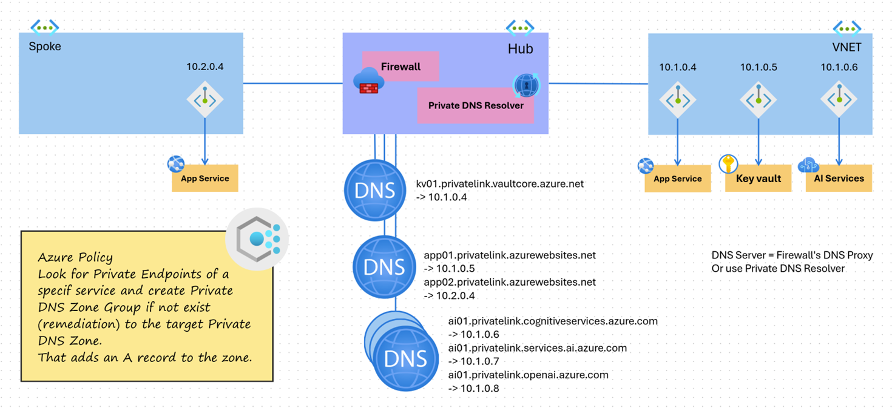

# Automating records creation with Azure Policy

This example demonstrates how to automate the creation of Private DNS records for Azure services using Azure Policy. The solution includes a policy that creates Private DNS Zones and Private DNS Records for various Azure services, such as App Service, Storage Account, and AI Services.

## Centralized DNS management

Centralized DNS management refers to the practice of managing DNS records and configurations from a single, centralized location or service. In this context, Azure Policy is used to enforce compliance and automate the creation of DNS records for Azure services. This approach allows for consistent management of DNS records across multiple resources and services, ensuring that all necessary records are created and maintained without manual intervention.



## Decentralized DNS management

Decentralized DNS management refers to the practice of managing DNS records and configurations across multiple, distributed locations or services. In this context, each Azure service is responsible for creating and maintaining its own DNS records, often leading to inconsistencies and potential misconfigurations. This approach can make it more challenging to ensure that all necessary DNS records are created and kept up to date.



## Deploying the resources

To deploy the resources, follow these steps:

```sh
terraform init
terraform plan
terraform apply
```

This will deploy PaaS services like App Service, Storage Account, and AI Services, along with the necessary Private DNS Zones and Private Endpoints.

Then a Policy Assignment is created to enforce the creation of Private DNS Zones and Private DNS Records for the deployed services.

> Note that deleting the Policy assignment deletes the remediation as well. This means the DNS records will be removed in our scenario.

> Note that Azure triggers the policies every 24 hours. But you can manually trigger a compliance evaluation using the following command.

```sh
az policy state trigger-scan # trigger for all subscription
# OR
az policy state trigger-scan -g <resource-group-name> # trigger for a specific resource group
```

> Note that services like AI Services or Storage Account that have multiple endpoints (e.g., privatelink.cognitiveservices.azure.com, privatelink.openai.azure.com, privatelink.services.ai.azure.com) require separate Private DNS Zones and policies for each endpoint.

> Note that there is also a policy for enabling Private Endpoint for Azure services.