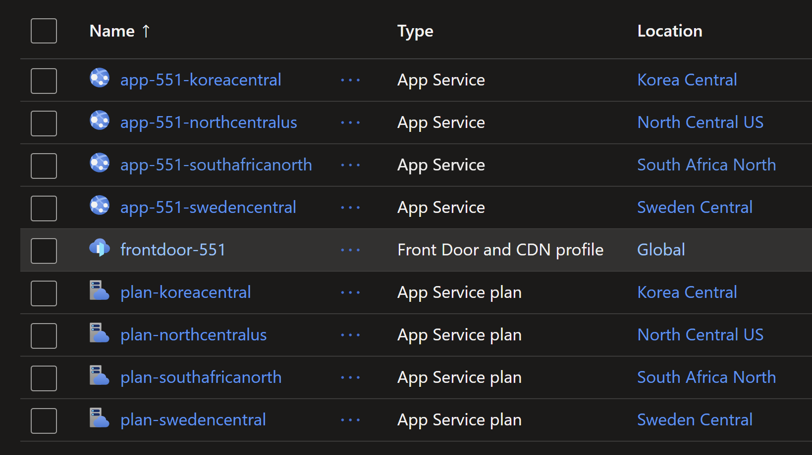
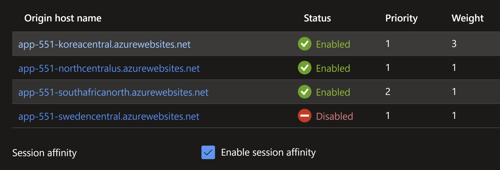

# Exploring Front Door routing features with Azure App Service

## Objective

In this lab, you will learn how to use `Azure Front Door` to route traffic to `Azure App Services` deployed in multiple regions.
You will explore the 4 methods of routing traffic in `Azure Front Door`:

1. Latency 
Ensures that requests are sent to the lowest latency origins acceptable within a sensitivity range.

2. Priority 
Used when you want to configure a primary origin to service all traffic. The secondary origin can be a backup in case the primary origin becomes unavailable.

3. Weighted 
Traffic gets distributed by the weight value. Just like canary deployments, you can send a small percentage of traffic to a new version of the application.

4. Session Affinity 
Ensure requests from the same end user gets sent to the same origin.

## Prerequisites

- An Azure subscription
- Terraform installed on your local machine
- Basic knowledge of Terraform and Azure services

## Deploying the solution

Run the following commands to deploy the solution using `terraform`.

```sh
terraform init
terraform plan -out=tfplan
terraform apply tfplan
```

Now you should have successfully exposed multiple `Azure App Services` configured as `origin` for `Azure Front Door` with `Terraform`. The following resources will be created.



You will work with the following priority, weight, latency and session affinity routing rules.

