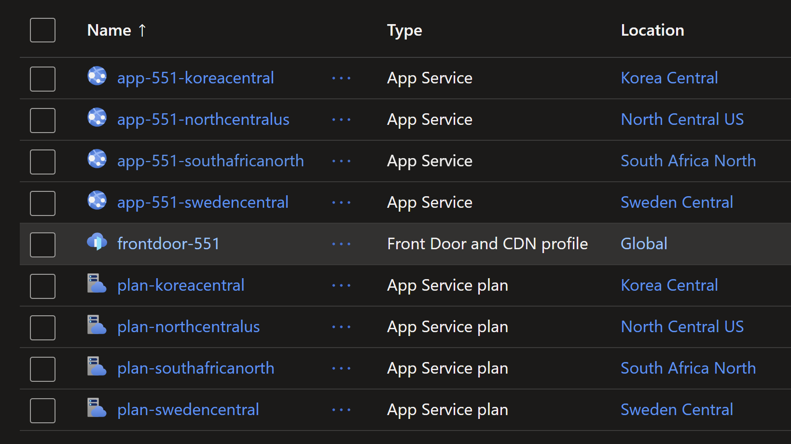
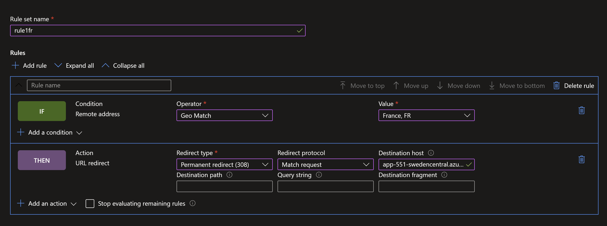

# Exploring Front Door routing rules

## Introduction

Azure Front Door is a global, scalable entry-point that uses the Microsoft global edge network to create fast, secure, and widely scalable web applications. It provides a single secure global entry point for web applications, APIs, content, and cloud services. Front Door enables you to define, manage, and monitor the global routing for your web traffic by optimizing for best performance and instant global failover for high availability.

In this lab, you will learn how to use Azure Front Door to route traffic to different Azure App Services based on the incoming request's country.

## Prerequisites

- An Azure subscription
- Terraform installed on your local machine
- Basic knowledge of Terraform and Azure services

## Deploying the solution

Run the following commands to deploy the solution using `terraform`:

```sh
terraform init
terraform plan -out=tfplan
terraform apply tfplan
```

Now you should have successfully exposed multiple `Azure App Services` configured as `origin` for `Azure Front Door` with `Terraform`. The following resources will be created.



You will define the following routing rules in `Azure Front Door`.

