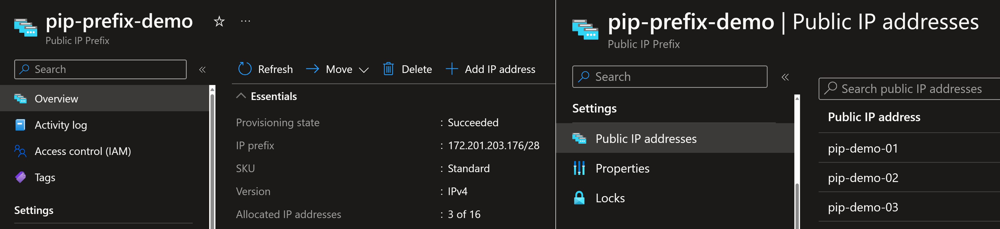

# Azure Public IP prefix

Create a new Public IP prefix with length 28. That will create 16 IPs.

```sh
az group create -n rg-pip-prefix -l westeurope

az network public-ip prefix create --length 28 -l westeurope -n pip-prefix-demo -g rg-pip-prefix
#   "ipPrefix": "172.201.203.176/28",
#   "location": "westeurope",
#   "name": "pip-prefix-demo",
#   "prefixLength": 28,
#   "publicIPAddressVersion": "IPv4",
#   "sku": {
#     "name": "Standard",
#     "tier": "Regional"
#   },
#   "type": "Microsoft.Network/publicIPPrefixes"
```



Create a new Public IP with address assigned from the prefix. Make sure to replace with your IP address.

```sh
az network public-ip create -g rg-pip-prefix -n pip-demo-01 --ip-address 172.201.203.176 --public-ip-prefix pip-prefix-demo

az network public-ip create -g rg-pip-prefix -n pip-demo-02 --ip-address 172.201.203.177 --public-ip-prefix pip-prefix-demo
```

Show the reserved IP addresses.

```sh
az network public-ip prefix show -n pip-prefix-demo -g rg-pip-prefix
# "publicIPAddresses": [
#     {
#       "id": "/subscriptions/38977b70-47bf-4da5-a492-88712fce8725/resourceGroups/rg-pip-prefix/providers/Microsoft.Network/publicIPAddresses/pip-demo-01",
#       "resourceGroup": "rg-pip-prefix"
#     },
#     {
#       "id": "/subscriptions/38977b70-47bf-4da5-a492-88712fce8725/resourceGroups/rg-pip-prefix/providers/Microsoft.Network/publicIPAddresses/pip-demo-02",
#       "resourceGroup": "rg-pip-prefix"
#     }
#   ],
```