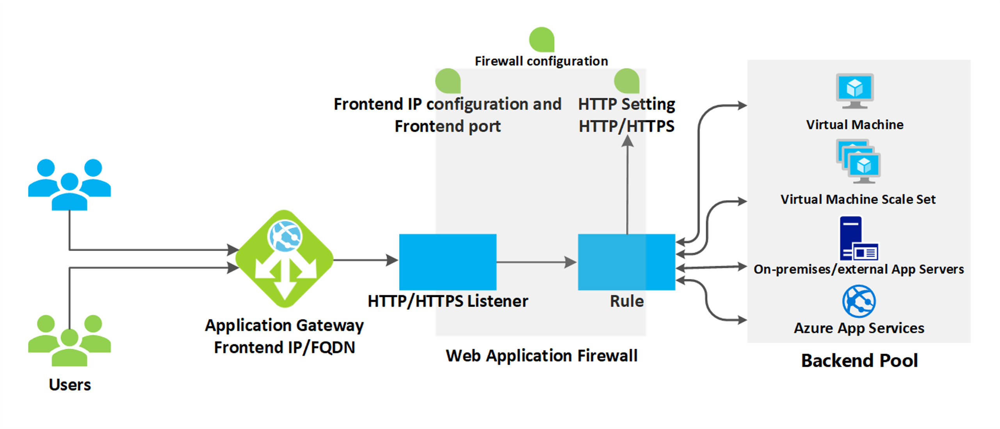

# Azure NAT Gateway

## Introduction

This repository contains Terraform code to create an Azure NAT Gateway. A NAT Gateway allows resources in a virtual network to access the internet while keeping their private IP addresses hidden.



To deploy the infrastructure, follow these steps:

```sh
terraform init
terraform apply -auto-approve
```

>Note: Azure Nat Gateway have added support for availability zones with the `sku: StandardV2`, so you can specify the zone in which the NAT Gateway should be created. This can help improve the availability and reliability of your NAT Gateway by distributing it across multiple zones. You can specify the zone using the `zones` argument in the `azurerm_nat_gateway` resource block in your Terraform code.