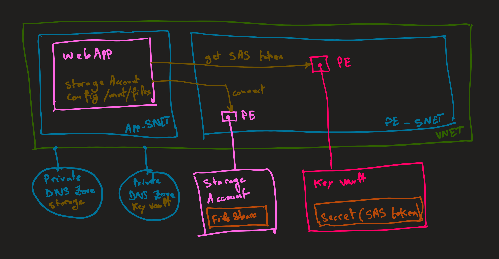
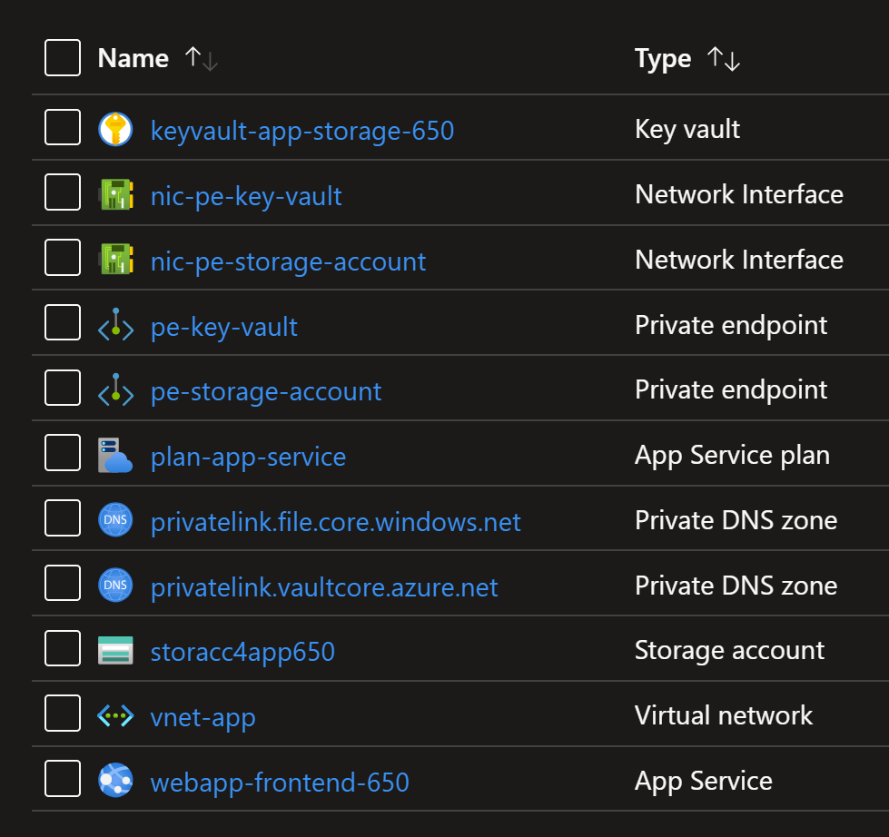

# App Service: Public Frontend and Private Backend

This template deploys a public facing `App Service web app` and a private facing `web app`.

The frontend web app is accessible from the internet and the backend web app is only accessible from the `virtual network`.

The frontend uses `VNET Integration` to access the backend web app.

The backend web app uses `Private Endpoint` to be privately accessible from the virtual network and frontend web app.



An `Azure VM` and `Bastion` are deployed to test connection from the `VNET` to the backend web app via `Private Endpoint`.

You can deploy the `terraform` template using the following command:

```sh
terraform init
terraform plan -out tfplan
terraform apply tfplan
```

The following resources will be created.



## Test Connection

Connect to the frontend web app and test the connection to the backend web app.

For that we'll leverage `Inspector Gadget` which is a simple web app that makes HTTP requests to a specified URL and displays the response.

