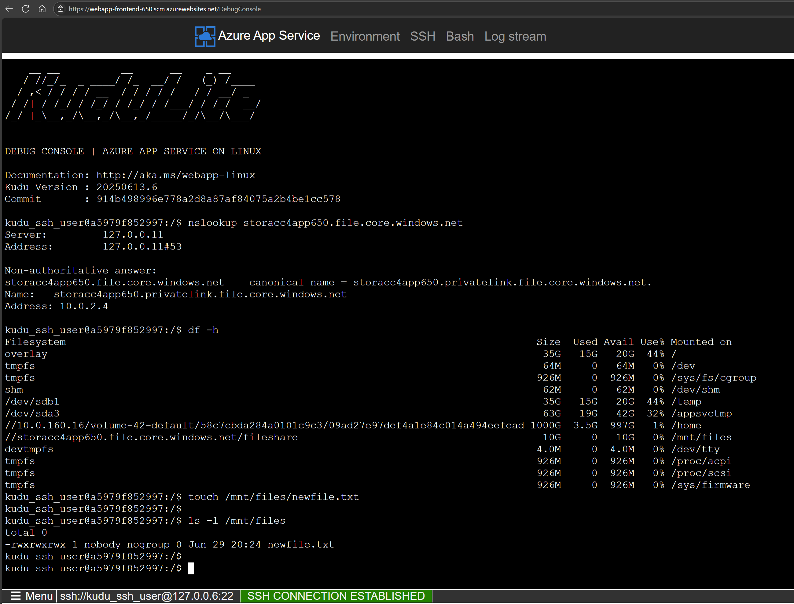
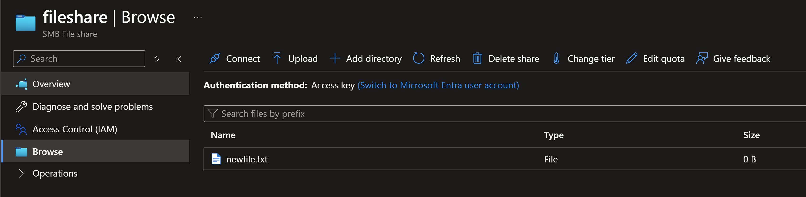

# App Service: Public Frontend and Private Backend

This template deploys an Azure App Service that uses a Storage Account File Share with a Private Endpoint and Key Vault integration.

The frontend web app is accessible from the internet and uses `VNET Integration` to access the Storage Account and Key Vault through Private Endpoints.


You can deploy the `terraform` template using the following commands:

```sh
terraform init
terraform plan -out tfplan
terraform apply tfplan
```

The following resources will be created.


## Test Connection

Connect to the frontend web app's console (SSH or Bash) and test the connection to the Storage Account File Share.
Verify that the web app can resolve the private DNS name of the Storage Account File Share.

```sh
Make sure to replace `<storage-account-file-share-name>` with the actual name of your Storage Account File Share.
```sh
nslookup <storage-account-file-share-name>.file.core.windows.net
# you should see the private IP address of the Storage Account Private Endpoint
```

Verify that the file share is mounted correctly. You should see a file share mounted.

```sh
df -h
# kudu_ssh_user@a68e45d96f3c:/$ df -h
# Filesystem                                                                             Size  Used Avail Use% Mounted on
# overlay                                                                                 35G   15G   20G  44% /
# tmpfs                                                                                   64M     0   64M   0% /dev
# tmpfs                                                                                  926M     0  926M   0% /sys/fs/cgroup
# shm                                                                                     62M     0   62M   0% /dev/shm
# //10.0.160.16/volume-42-default/58c7cbda284a0101c9c3/09ad27e97def4a1e84c014a494eefead 1000G  3.5G  997G   1% /home
# /dev/sdb1                                                                               35G   15G   20G  44% /temp
# /dev/sda3                                                                               63G   19G   42G  31% /appsvctmp
# //storacc4app650.file.core.windows.net/fileshare                                        10G     0   10G   0% /mnt/files
# devtmpfs                                                                               4.0M     0  4.0M   0% /dev/tty
# tmpfs                                                                                  926M     0  926M   0% /proc/acpi
# tmpfs                                                                                  926M     0  926M   0% /proc/scsi
# tmpfs                                                                                  926M     0  926M   0% /sys/firmware
```

Create a new file in the Storage Account File Share and verify that it is created successfully.

```sh
touch /mnt/files/newfile.txt
ls -l /mnt/files
```



Now go to the Azure Portal and navigate to the Storage Account File Share. You should see the new file created in the File Share.



## Important notes

* Key vault integration to mount File share to App Service supports RBAC mode in Key vault. Our public documentation didn't mentioned anything about RBAC mode. It provided examples only with access policies. But it seems that RBAC mode works fine.
