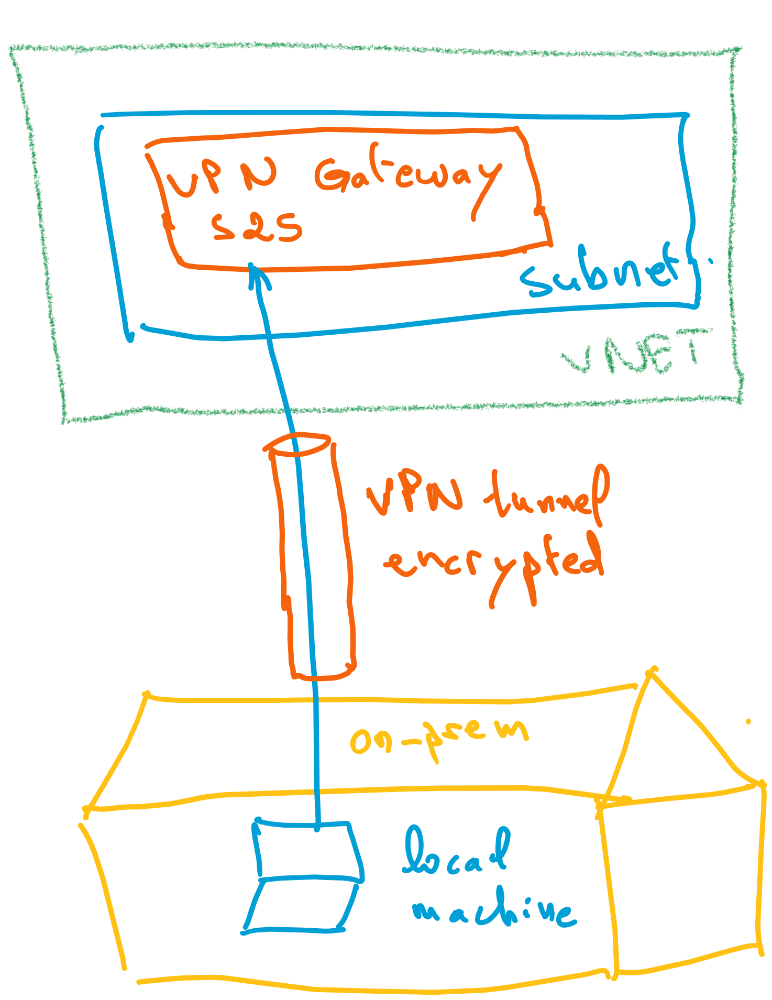

# Azure VPN Gateway P2S with Entra ID authentication

This lab shows how to create a Point-to-Site (P2S) VPN Gateway in Azure that uses Entra ID for authentication.



## Deploying the lab resources

To create the resources, run the following commands:

```sh
$env:ARM_SUBSCRIPTION_ID=(az account show --query id -o tsv)

terraform init
terraform apply -auto-approve
```

## Connecting to the Azure VPN

Then you can navigate to the Azure portal and configure your VPN client with the generated configuration file. Download the configuration file from the Azure portal and import it into your VPN client. For this you will need to install the `Azure VPN Client` app on your local machine. You can simply install it from the Microsoft Store or from here [https://aka.ms/azvpnclientdownload](https://aka.ms/azvpnclientdownload).

If you are using Linux, you can install `Azure VPN Client` following the instructions from [this link](https://learn.microsoft.com/en-us/azure/vpn-gateway/point-to-site-entra-vpn-client-linux#install-the-azure-vpn-client). And the same for MacOS, you can follow the instructions from [this link](https://learn.microsoft.com/en-us/azure/vpn-gateway/point-to-site-entra-vpn-client-mac).

