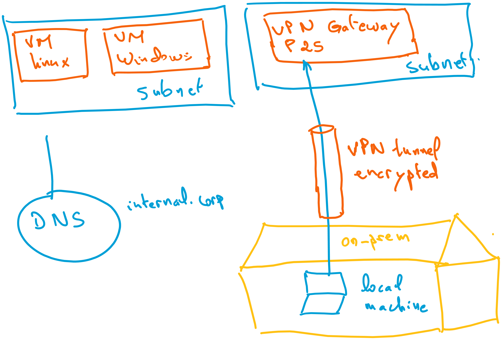

# Azure VPN Gateway



## The objectives of this example

1. Validate that `Azure VPN Gateway` can be used to provide Point-to-Site (P2S) access to Azure resources deployed within the Hub. In our use case that is an Azure VM.

2. `Azure VPN Gateway` cannot resolve `Private DNS Zones` within the Hub.

## Deploying the resources

Make sure to set the following environment variable for terraform to use your Azure subscription:

```sh
$env:ARM_SUBSCRIPTION_ID=(az account show --query id -o tsv)
```

Then you are ready to deploy the resources using Terraform:

```sh
terraform init
terraform apply -auto-approve
```
