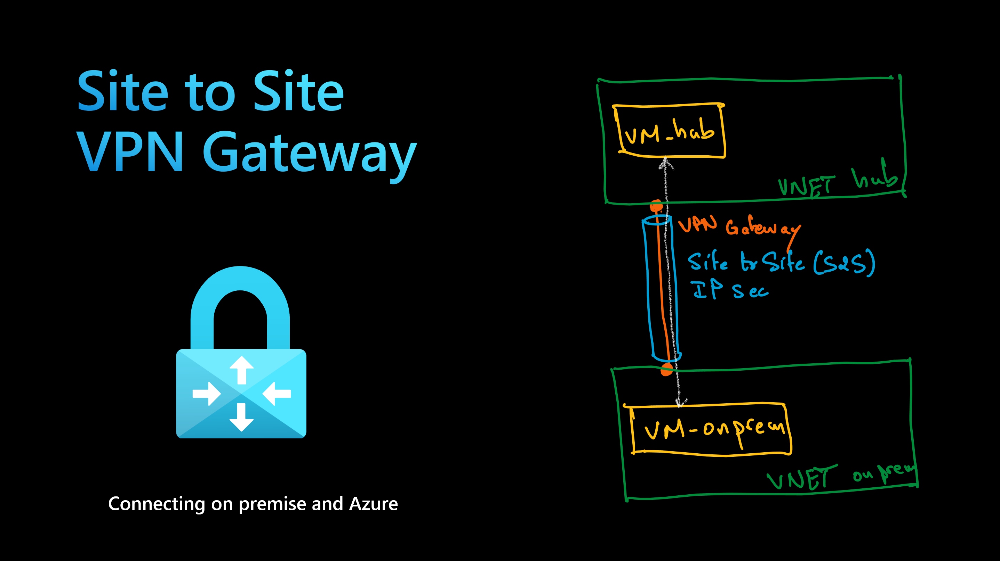

# Azure VPN Gateway S2S

The objective of this lab is to use `Site to Site VPN Gateway` to connect `on-premises` environment to Azure virtual network `VNET Hub`.
The following architecture shows the different components.



Note that the hub VM and the on-prem VM will be used to verify connectivity between on-prem and hub network.

First, you need to deploy the resources through `Terraform` by running:

```sh
terraform init
terraform plan -out tfplan
terraform apply tfplan
```

It will take about 40 minutes to deploy all resources.

Then you can connect to both VMs and verify they connect to each other.
You need to get the private IP address for each VM.
Each VM run a sample Nginx app. You will run `curl` against the web app running on these VMs.

```sh
curl 172.16.0.4
# Hello from virtual machine: vm-linux-onprem, with IP address: 172.16.1.4

curl 10.0.0.4
# Hello from virtual machine: vm-linux-hub, with IP address: 10.0.2.4
```

This proves the connectivity between on-premises and Azure.