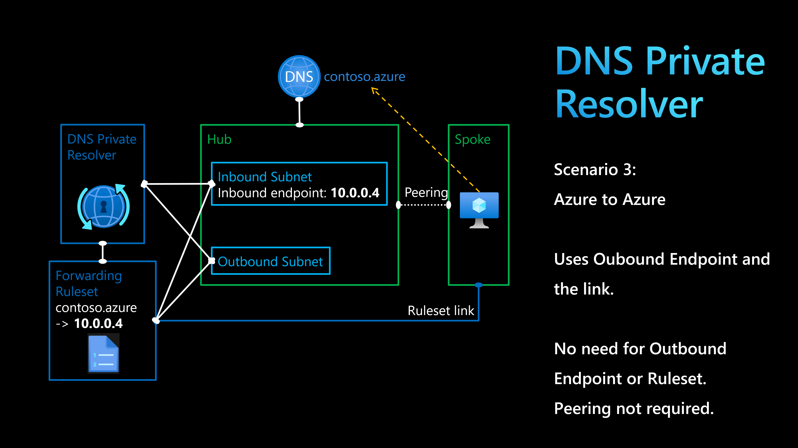

# Azure DNS Private Resolver

`Azure DNS Private Resolver` could be used to resolve domain names in three scenarios:
1) On-prem to Azure
2) Azure to on-prem
3) Azure to Azure

This lab will explore the `Azure to Azure` scenario.



Terraform creates the following resources.

1) Create Hub VNET with no Subnet
2) Create `Private DNS Zone` called `corp.azure` and an `A record` called `addr1`
3) Link the `Private DNS Zone` to the Hub VNET
4) Create a Linux VM in the Hub VNET called vm-linux-hub
5) Try to resolve the domain name from the vm-linux-hub using `nslookup addr1.corp.azure`, should work
6) Create a Spoke VNET (peering not required) with a Subnet for VMs
7) Deploy a VM in Spoke VNET called vm-linux-spoke
8) Try to resolve the domain name from the vm-linux-spoke using `nslookup addr1.corp.azure`, won't work
9) Create `DNS Private Resolver` (empty)
10) Create `Inbound Endpoint` for DNS Private Resolver in new Subnet
11) Create `Outbound Endpoint` for DNS Private Resolver in new Subnet
12) Create a `Ruleset` (empty)
13) Create a Ruleset rule for `corp.azure`
14) Create Ruleset link to Spoke VNET
15) Try to resolve the domain name from the vm-linux-spoke using `nslookup addr1.corp.azure`, should work

The above steps and resources could be deployed by running the following `terraform` command.

```sh
terraform init
terraform apply -auto-approve
```

From the vm-linux-spoke, run the following command to ensure DNS resolution is working thanks to using `DNS Private Resolver`.

```sh
nslookup addr1.corp.azure
```