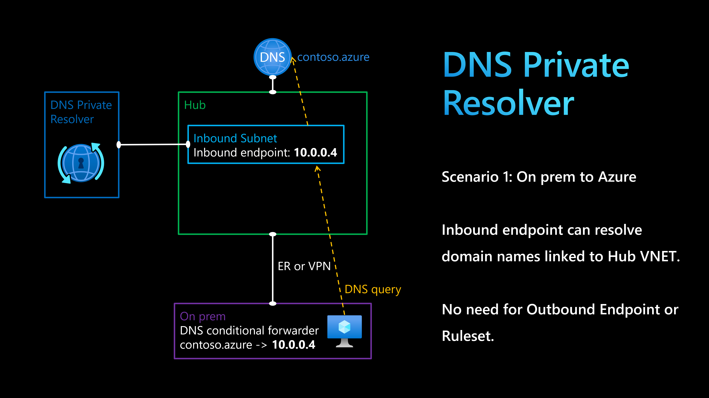

# Azure DNS Private Resolver

`Azure DNS Private Resolver` could be used to resolve domain names in three scenarios:
1) On-prem to Azure
2) Azure to on-prem
3) Azure to Azure

This lab will explore the `Azure to Azure` scenario.



The terraform template will create a VPN Gateway with P2S configuration.
Make sure you install the VPN Client in your machine.

From `on-prem`, you can resolve domain names in Azure using `DNS Private Resolver`.

```sh
terraform init
terraform apply -auto-approve
```

From the vm-linux-spoke, run the following command to ensure DNS resolution is working thanks to using `DNS Private Resolver`.

```sh
nslookup addr1.corp.azure
```