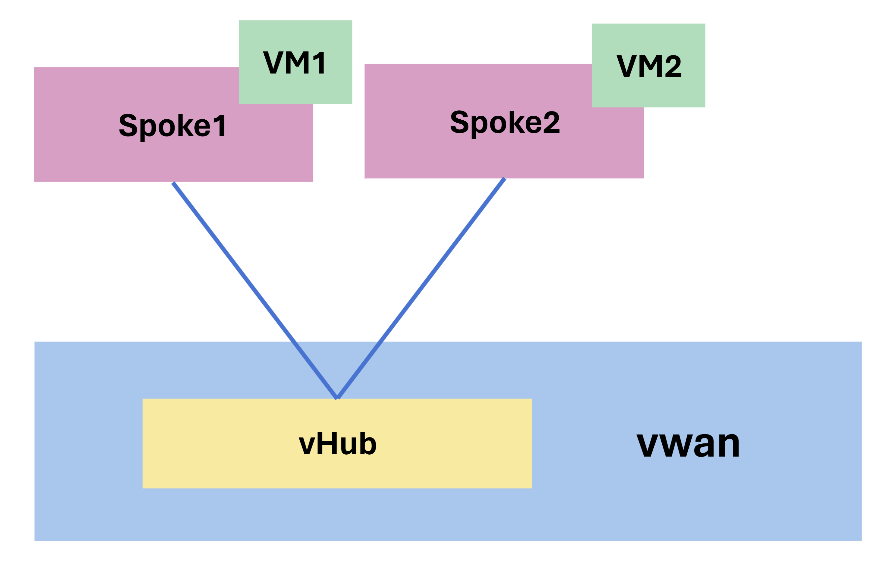
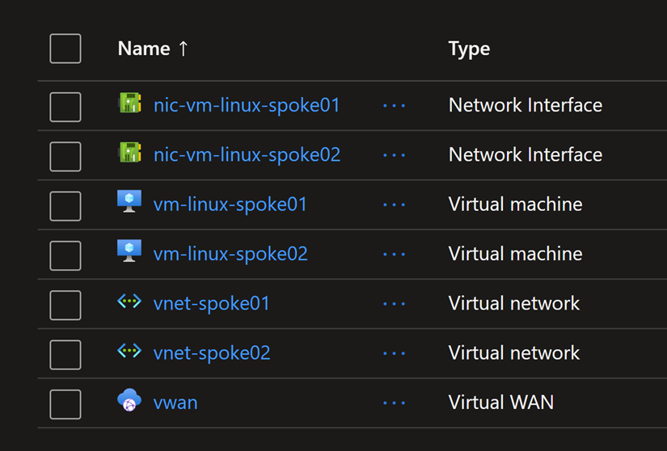

# Azure Virtual Wan and Virtual Hub

## Objectives

* Within a VWAN without Firewall and without Route Table, the traffic between VNets is allowed.



## Deploying the resources using Terraform

1. Open a terminal and navigate to the directory containing the Terraform files.

2. Set the Azure subscription ID environment variable:

```sh
$env:ARM_SUBSCRIPTION_ID=(az account show --query id -o tsv)
```

3. Run the following commands to initialize Terraform, plan the deployment, and apply the changes:

```bash
terraform init
terraform apply -auto-approve
```

The following resources will be created.



## Testing the connectivity between the two Spoke VNETs

Navigate to the Azure VMs in the Spoke VNETs and test the connectivity between them using `ping` or `curl` commands.
Each VM exposes a web server on port 80, so you can also test HTTP connectivity.

From VM1, test connection to VM2.

```sh
ping 10.11.0.4

curl 10.11.0.4
```

From VM2, test connection to VM1.

```sh
ping 10.12.0.4

curl 10.12.0.3
```

>Note that the private IP addresses `10.11.0.4` and `10.12.0.4` are the ones assigned to the VMs in the Spoke VNETs.