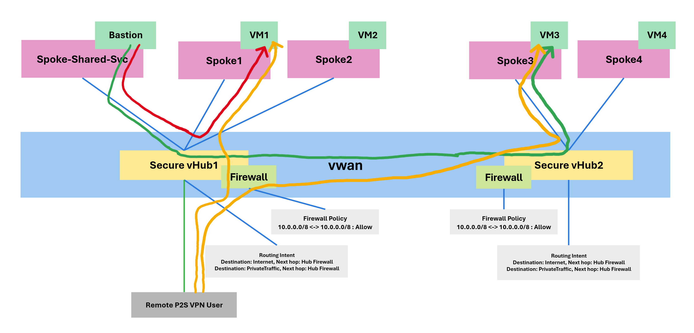
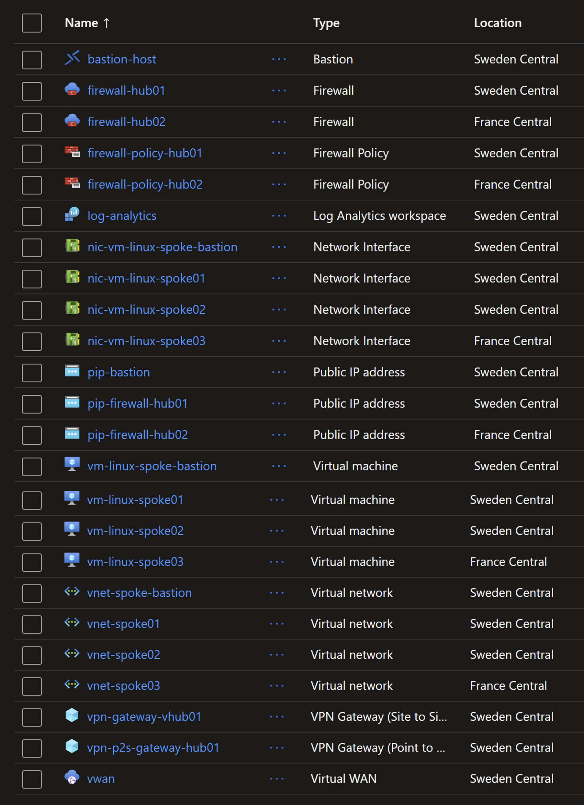

# Azure Virtual Wan and Secure Virtual Hub with Intent based Routing

In this lab you will explore connectivity between `Azure Virtual WAN`, `Secure virtual Hub`, `Azure Bastion` and `Azure VPN P2S`. The focus is on understanding how to:

1. Establish connectivity from `Azure Bastion` to VMs in `Virtual Networks` in different `Secure Virtual Hubs`.
2. Configure `Point-to-Site VPN` connections to the `Virtual Hubs`.


We'll explore the following traffic flows:



## Deploying the resources

To deploy the resources, run the following commands:

```sh
$env:ARM_SUBSCRIPTION_ID=(az account show --query id -o tsv)

terraform init
terraform apply -auto-approve
```

This will take about 45 minutes. Then the following resources will be created:



## Testing connection from Bastion to VMs in different virtual Hubs

To check that `Azure Bastion` can connect to VMs in different `Virtual Hubs`, you can use the Bastion host to connect to the VMs in the `Spoke` networks.

From the `Azure Portal`, navigate to the Bastion host and use the `Connect` feature to connect to the VMs in the `Spoke` networks. We use Bastion with `Standard SKU` which allows us to connect to VMs using RDP or SSH and by specifying the appropriate IP address.

You can connect to the VMs in `Spoke01` and `Spoke02` in `Hub01`, and `Spoke03` in `Hub02`.

You will need the private IP addresses for these VMs, which are as follows:

* VM in Spoke01: `10.1.0.4`
* VM in Spoke02: `10.2.0.4`
* VM in Spoke03: `10.3.0.4`

## Testing connection from VPN P2S to Spokes in Secure vHubs

The terraform template created a `Point-to-Site VPN` connection to the `Virtual Hub`. You can connect to the VPN using the provided client configuration.

You need to download the VPN client configuration from the `Microsoft Store` or from [App Center](https://install.appcenter.ms/users/user-microsoft/apps/azure-vpn-client-1/distribution_groups/publicgroup/releases/21). 
More details on how to download the client configuration can be found in the [Azure documentation](https://docs.microsoft.com/en-us/azure/vpn-gateway/vpn-gateway-download-vpn-client).

Once you have the client configuration, you can install it on your local machine.

Then you need to download the VPN client configuration from the `Azure Portal` under `your vWAN resource.


Then you can import the configuration into the `Azure VPN Client` application.

After that, you can connect to the VPN by selecting the profile and clicking on `Connect`.

Once connected, you can access the VMs in the `Spoke` networks using their private IP addresses.

Try the following commands from your local machine after connecting to the VPN:

```sh
# Ping the VM in Spoke01 vHub01
ping 10.1.0.4
# Access the Nginx app in Spoke01 vHub01
curl 10.1.0.4

# Ping the VM in Spoke02 vHub01
ping 10.2.0.4
# Access the Nginx app in Spoke02 vHub01
curl 10.2.0.4

# Ping the VM in Spoke03 vHub02
ping 10.3.0.4
# Access the Nginx app in Spoke03 vHub02
curl 10.3.0.4
```

You should see a response from all the VMs in the Spoke networks.

## Checking the traffic path

The Terraform template already enabled collecting logs for the two Azure Firewalls. You can check the logs to see the traffic flow between the VNets.

## Learnings

* Without Firewall and without Route Table, the traffic between VNets in the same and across Virtual Hubs is allowed.

* A general recommendation is to dissociate security from routing. This means it is recommended to open the traffic between VNets in the same Virtual Hub and across Virtual Hubs, and then use Firewall to control the traffic.

* Bastion is installed in a dedicated VNET where there Route `0.0.0.0/0` is not injected by default by the Intent Route Table. This is done by disabling `enableInternetSecurity` in the vHub - VNET connection. This allows Bastion to connect to the Internet which is required for the management plane. Details: https://blog.cloudtrooper.net/2022/09/17/azure-bastion-routing-in-virtual-wan/

With this configuration, you can use Bastion to connect to the VMs in the VNets within the same vHub as the Bastion and also the VNets in the other vHubs.
