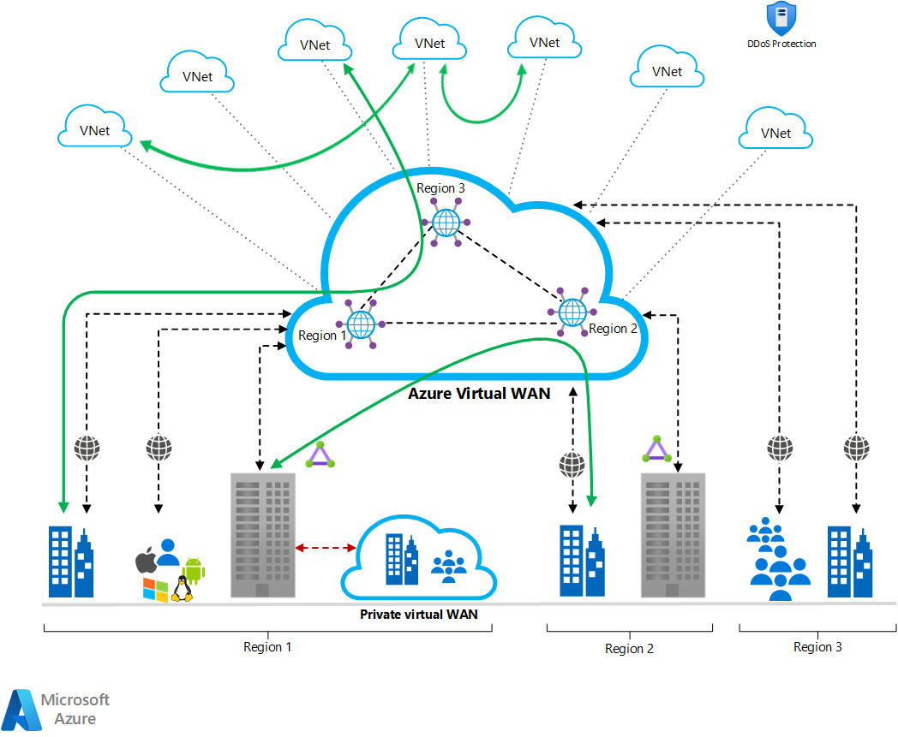
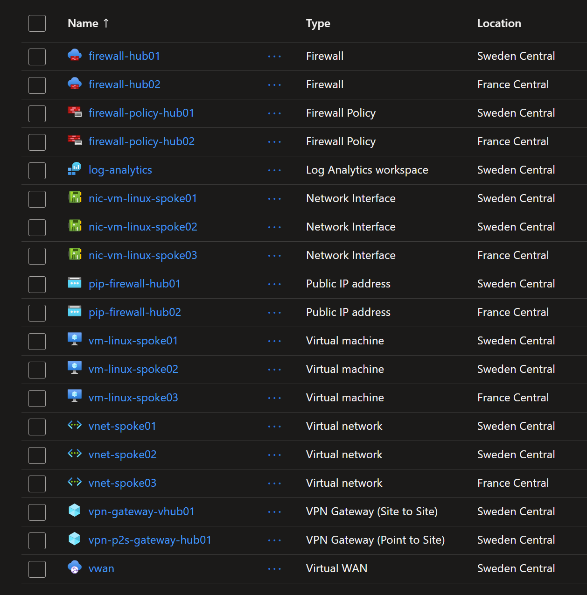

# Azure Virtual Wan and Secure Virtual Hub with Intent based Routing

In this lab you will explore `Azure Virtual WAN` and `Virtual Hub` with two hubs, each with a firewall. The focus is on understanding how traffic flows between VNets in different hubs when firewalls are configured.

Without any firewall or route table, traffic between VNets in the same Virtual Hub and across Virtual Hubs is allowed. This lab will help you understand how to control this traffic using firewalls and routing policies.

For that we will create two Virtual Hubs, each with a firewall, define routing intents and then we will create VNets in each hub. We will then test the connectivity between these VNets.



## Deploying the resources

To deploy the resources, run the following commands:

```sh
$env:ARM_SUBSCRIPTION_ID=(az account show --query id -o tsv)

terraform init
terraform apply -auto-approve
```

This will take about 45 minutes. Then the following resources will be created:



## Testing connection from Spoke VNET01 to VNET02 in Hub01

To check that VNETs in the same `virtual Hub` can communicate, you can use the VM Spoke01 in Hub01 to ping the VM in Spoke02 in the same hub. And as each VM exposes an Nginx app, you can also access the Nginx app in Spoke02 from Spoke01 using the curl command. 

From VM Spoke01, navigate to `run command` feature and run the following:

```sh
# Ping the VM in Spoke02
ping 10.2.0.4

# Access the Nginx app in Spoke02
curl 10.2.0.4
```

You should see a response from the Nginx app running on the VM in Spoke02.

Do the same from VM Spoke02 to Spoke01:

```sh
# Ping the VM in Spoke01
ping 10.2.0.4

# Access the Nginx app in Spoke01
curl 10.2.0.4
```

## Testing connection from Spokes intra Secure vHubs

Now we want to check if the VNETs in different vhubs can communicate. From VM Spoke01 in Hub01, you can ping the VM in Spoke03 in Hub02 and access its Nginx app.

From VM Spoke01, run the following commands:

```sh
# Ping the VM in Spoke03
ping 10.3.0.4

# Access the Nginx app in Spoke03
curl 10.3.0.4
```

You should see a response from the Nginx app running on the VM in Spoke03.

## Checking the traffic path

The Terraform template already enabled collecting logs for the two Azure Firewalls. You can check the logs to see the traffic flow between the VNets.

## Learnings

* Without Firewall and without Route Table, the traffic between VNets in the same and across Virtual Hubs is allowed.

* A general recommendation is to dissociate security from routing. This means it is recommended to open the traffic between VNets in the same Virtual Hub and across Virtual Hubs, and then use Firewall to control the traffic.

* Bastion is installed in a dedicated VNET where there Route `0.0.0.0/0` is not injected by default by the Intent Route Table. This is done by disabling `enableInternetSecurity` in the vHub - VNET connection. This allows Bastion to connect to the Internet which is required for the management plane. Details: https://blog.cloudtrooper.net/2022/09/17/azure-bastion-routing-in-virtual-wan/

With this configuration, you can use Bastion to connect to the VMs in the VNets within the same vHub as the Bastion and also the VNets in the other vHubs.
