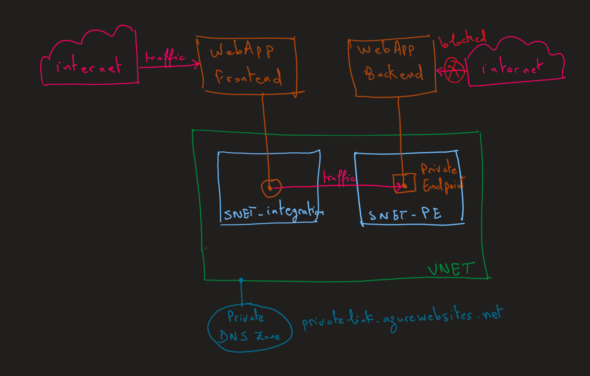
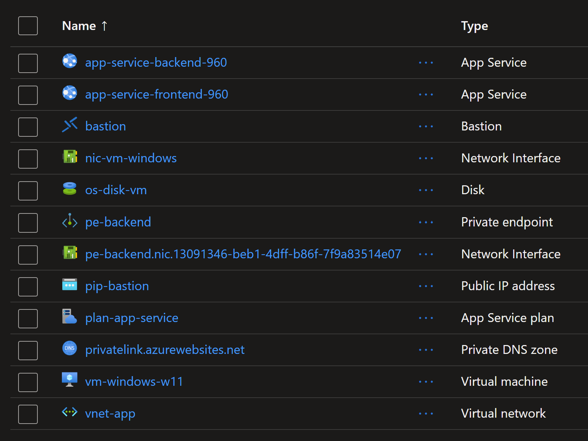

# App Service: Public Frontend and Private Backend

This template deploys a public facing `App Service web app` and a private facing `web app`.

The frontend web app is accessible from the internet and the backend web app is only accessible from the `virtual network`.

The frontend uses `VNET Integration` to access the backend web app.

The backend web app uses `Private Endpoint` to be privately accessible from the virtual network and frontend web app.



An `Azure VM` and `Bastion` are deployed to test connection from the `VNET` to the backend web app via `Private Endpoint`.

You can deploy the `terraform` template using the following command:

```sh
terraform init
terraform plan -out tfplan
terraform apply tfplan
```

The following resources will be created.



## Findings

* Environment variable `WEBSITE_PRIVATE_IP` (ex. `10.1.2.254`) is the same for 2 web apps in the same ASP and same Subnet.

* When frontend calls backend web app, both in the same ASP and Subnet, backend sees the calling/source IP as `X-Client-IP: 10.1.2.254`.
The same applies cross VNET, the backend web app in the other VNET sees the following `X-Client-IP: 10.1.2.254`.

* For frontend app:
Local IP Address	169.254.130.5
Remote IP Address	169.254.130.1

* For backend app:
Local IP Address	169.254.129.2
Remote IP Address	169.254.129.1

* To route traffic to Firewall, property `vnetRouteAllEnabled: true` should be set.

